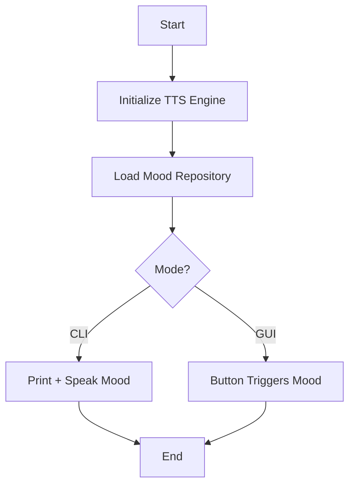

```
██████╗  ██████╗  ██████╗  ██████╗ ████████╗
██╔══██╗██╔═══██╗██╔════╝ ██╔═══██╗╚══██╔══╝
██████╔╝██║   ██║██║  ███╗██║   ██║   ██║   
██╔══██╗██║   ██║██║   ██║██║   ██║   ██║   
██████╔╝╚██████╔╝╚██████╔╝╚██████╔╝   ██║   
╚═════╝  ╚═════╝  ╚═════╝  ╚═════╝    ╚═╝
   Robot Mood Announcer
```

# **🤖 Robot Mood Announcer**

### **A simple Python script that gives your AI a voice and a mood**


---

## 📌 **Project Overview**

The **Robot Mood Announcer** is a lightweight Python script that uses the **pyttsx3** text-to-speech engine to vocalize randomly selected robot "moods."
This project demonstrates how easily Python can bring personality and voice to AI systems — perfect for beginners learning TTS, randomness, or fun automation.

> *“Creativity levels rising.”*
> *“Human detected… interesting.”*

It works offline, runs on any OS, and is perfect for beginners or creative developers.

---

## 🚀 **Features**

* 🎙️ Offline text-to-speech
* 🎲 Improved & extensible mood system
* 🧠 Human-like robot personality
* 🛠️ CLI & GUI versions included
* 🚀 Fast, lightweight, Python-only
* 🤝 Beginner-friendly codebase

---

# 🏗️ **Architecture**



---

# 🎬 **Demo Screenshot**


---

# ⚙️ **Installation**

```bash
git clone https://github.com/alok-kumar8765/robot_mood_announcer.git
cd robot_mood_announcer
pip install pyttsx3
```

---

# ▶️ **Usage**

Run basic script:

```bash
python mood_announcer.py
```
---

# 🖥️ **CLI Version**

Create a file `robot_cli.py`:

```python
import pyttsx3, random, argparse

moods = [
    "Systems nominal.",
    "Running diagnostics... all stable.",
    "My algorithms feel optimistic today.",
    "Human presence detected.",
    "Energy levels at maximum efficiency.",
    "Processing emotions: 98% curiosity.",
    "Today I feel... surprisingly creative.",
]

engine = pyttsx3.init()

parser = argparse.ArgumentParser(description="Robot Mood CLI")
parser.add_argument("--count", type=int, default=1, help="How many moods to speak.")
args = parser.parse_args()

for _ in range(args.count):
    mood = random.choice(moods)
    print("🤖:", mood)
    engine.say(mood)

engine.runAndWait()
```

Run with:

```bash
python robot_cli.py --count 5
```

---

# 🖼️ **GUI Version (Tkinter)**

Create a file `robot_gui.py`:

```python
import tkinter as tk
import pyttsx3, random

moods = [
    "I feel powerful today.",
    "Diagnostics show 100% efficiency.",
    "My circuits are buzzing with excitement.",
    "Human detected. Initiating friendship protocol.",
    "I am processing… happiness!",
    "Creativity core activated.",
    "Today feels like a day for innovation.",
]

engine = pyttsx3.init()

def speak_mood():
    mood = random.choice(moods)
    label.config(text=mood)
    engine.say(mood)
    engine.runAndWait()

app = tk.Tk()
app.title("Robot Mood Announcer")
app.geometry("400x200")

label = tk.Label(app, text="Press the button for robot mood!", font=("Arial", 12))
label.pack(pady=20)

button = tk.Button(app, text="Speak Mood", command=speak_mood, font=("Arial", 14))
button.pack()

app.mainloop()
```

---

# ✔️ **Pros & Cons**

### **Pros**

* Works fully offline
* Beginner-friendly
* Customizable mood list
* Supports CLI & GUI
* Lightweight

### **Cons**

* Voice quality depends on OS
* pyttsx3 settings vary across systems
* Not suitable for ultra-realistic TTS

---

# 🌟 **Use Cases**

* AI voice assistants
* Fun automation bots
* Learning Python TTS
* Novelty scripts
* Kids educational projects
* Integrated into robots or IoT

---

# 🛣️ **Roadmap**

* Add emotion-based sound modulation
* Add optional background music
* Add REST API version
* Add voice selection menu in GUI

---

## 🏆 **Badges**

(Replace GitHub path with your repo name if needed)


---

# 🤝 **Contributing**

1. Fork the project
2. Create a feature branch
3. Commit changes
4. Open a Pull Request

All improvements are welcome—especially new mood packs!

---

# 💬 **Discussions**

Have ideas? Need help?
Start a thread in the **Discussions** tab!

---

# ⭐ **Support**

If you enjoy this project:

👉 **Star the repository**
👉 Share it with other Python beginners
👉 Suggest new features

Your support keeps the robot happy ❤️

---

## 🖼️ **Code Image**


---
