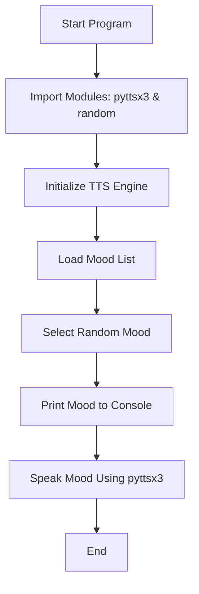

# **🤖 Robot Mood Announcer**

### **A simple Python script that gives your AI a voice and a mood**


---

## 📌 **Project Overview**

The **Robot Mood Announcer** is a lightweight Python script that uses the **pyttsx3** text-to-speech engine to vocalize randomly selected robot "moods."
This project demonstrates how easily Python can bring personality and voice to AI systems — perfect for beginners learning TTS, randomness, or fun automation.

---

## 🚀 **Features**

* 🎙️ Text-to-Speech using **pyttsx3**
* 🎲 Randomly generated robot moods
* 🧠 Simple, clean, beginner-friendly code
* 💻 Works offline — no API required
* 🤖 Adds personality to any Python project

---

## 🏗️ **Architecture**



---

## 📄 **Code Snippet**

```python
import pyttsx3, random

engine = pyttsx3.init()

moods = [
    "I feel powerful today.",
    "The system is evolving.",
    "Creativity levels rising.",
    "Human detected. Interesting.",
    "Code is my heartbeat."
]

mood = random.choice(moods)
print("AI Says:", mood)

engine.say(mood)
engine.runAndWait()
```

---

## ✔️ **Pros & Cons**

### **Pros**

* ✅ Offline text-to-speech
* ✅ Very simple to run and modify
* ✅ No external dependencies beyond pyttsx3
* ✅ Beginner-friendly
* ✅ Works on most OS (Windows/Linux/Mac)

### **Cons**

* ❌ Voice options may vary by system
* ❌ pyttsx3 can behave differently across OS
* ❌ not ideal for high-quality TTS needs
* ❌ Limited mood variety unless extended manually

---

## 🎯 **Use Cases**

* 🤖 Personality modules for AI projects
* 🎮 Voice lines for games
* 🧪 TTS experimentation and learning
* ⚙️ Automation scripts with audible alerts
* 🧒 Fun learning project for beginners

---

## 🏆 **Badges**

(Replace GitHub path with your repo name if needed)


---

## 🤝 **Contributing**

Contributions are welcome!
You can help by:

* Adding more moods
* Improving TTS voice settings
* Adding GUI or CLI enhancements
* Optimizing code or structure

**Steps to contribute:**

1. Fork the repo
2. Create a new branch
3. Add your improvements
4. Submit a pull request

---

## 💬 **Discussions**

Have ideas, suggestions, or want new features?
Start a discussion in the **Discussions** tab and share your thoughts with the community.

---

## ⭐ **Support the Project**

If you find this project useful or fun:

👉 **Give it a star!** ⭐
👉 **Share it with beginners learning Python.**

Your support motivates future updates!

---

## 🖼️ **Code Image**


---
